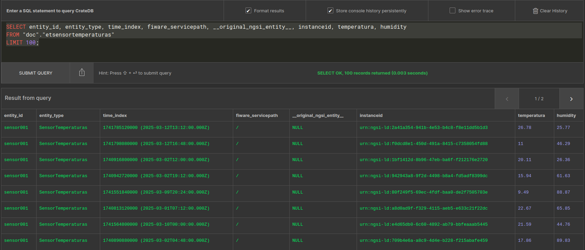
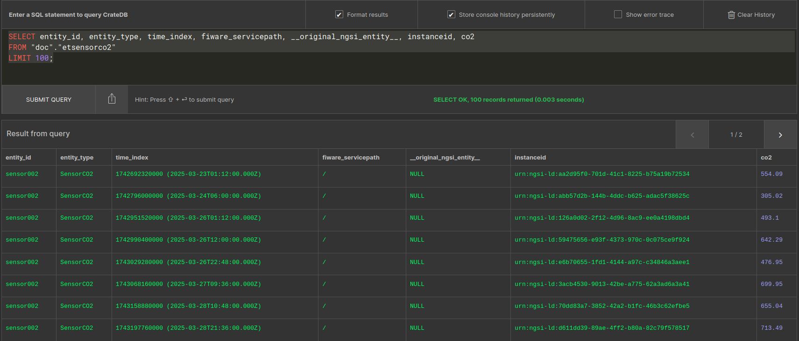
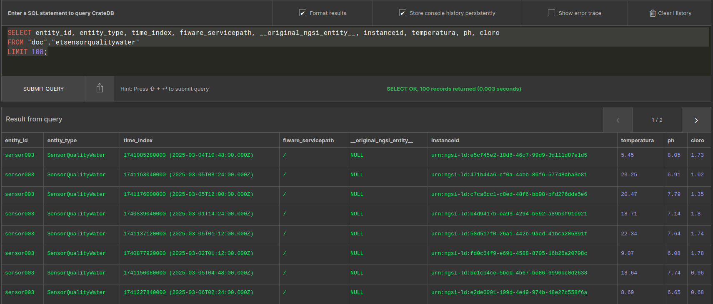

# 🗃️ Base de Datos CrateDB – Proyecto Smart City

Este módulo documenta la estructura de datos y las consultas realizadas en **CrateDB**, el motor de almacenamiento utilizado para persistir datos históricos provenientes de los sensores de la ciudad inteligente.

---

## 📦 Tablas disponibles en CrateDB

Estas son las principales tablas que contienen los datos de los sensores:

| Tabla                  | Descripción                                          | Registros |
|------------------------|------------------------------------------------------|-----------|
| `etsensorco2`          | Valores de concentración de CO₂                     | 400       |
| `etsensortemperaturas` | Datos de temperatura y humedad                      | 400       |
| `etsensorqualitywater` | Medidas de pH, temperatura del agua y cloro         | 400       |
| `md_ets_metadata`      | Información auxiliar o metadatos del sistema        | 3         |

📸 Vista general:


---

## 🔍 Consulta de datos por sensor

### 📌 Sensor001 – Temperatura y Humedad

Consulta SQL:
```sql
SELECT entity_id, entity_type, time_index, fiware_servicepath, __original_ngsi_entity__, 
       instanceid, temperatura, humidity
FROM "doc"."etsensortemperaturas"
LIMIT 100;
```

📸 Resultados:



---

### 📌 Sensor002 – CO₂

Consulta SQL:
```sql
SELECT entity_id, entity_type, time_index, fiware_servicepath, __original_ngsi_entity__, 
       instanceid, co2
FROM "doc"."etsensorco2"
LIMIT 100;
```

📸 Resultados:



---

### 📌 Sensor003 – Calidad del Agua (pH, temperatura y cloro)

Consulta SQL:
```sql
SELECT entity_id, entity_type, time_index, fiware_servicepath, __original_ngsi_entity__, 
       instanceid, temperatura, ph, cloro
FROM "doc"."etsensorqualitywater"
LIMIT 100;
```

📸 Resultados:



---

## 🧠 Notas técnicas

- **`time_index`**: Timestamp de cada evento en formato epoch + ISO 8601.
- **`instanceid`**: URN único de cada medición registrada.
- **`fiware_servicepath`**: Rutas de contexto para compartimentar entidades.
- Todos los sensores utilizan el mismo esquema básico: `entity_id`, `entity_type`, `time_index`, atributos específicos.

---

## 📍 Ubicación

Estas tablas son creadas y gestionadas automáticamente a través de **QuantumLeap**, que persiste los datos recibidos por **Orion Context Broker**.

---

## 👨‍💻 Autor

- Gabriel Rodriguez – *Estudiante de Inteligencia Artificial y Big Data en CIPFP Mislata*

